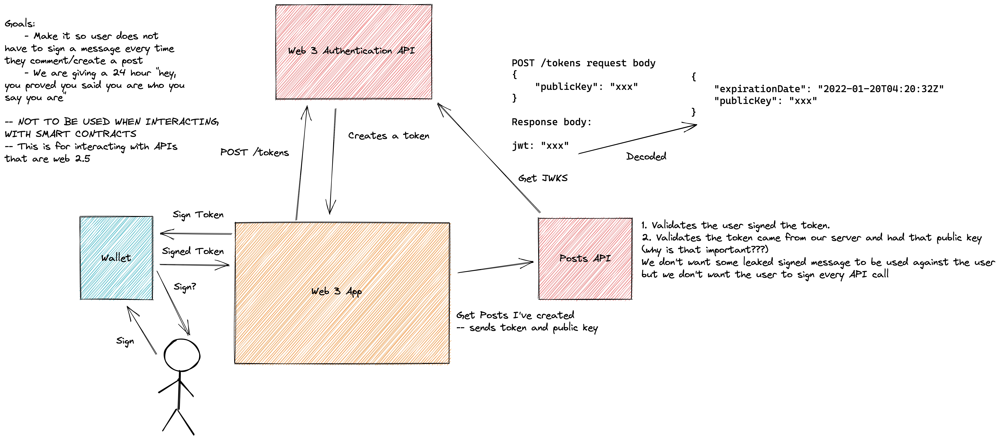

### Goal

In web3, we have two types of applications.

*Pure Web3 Apps* - A "pure" web3 app is one that only interacts with smart contracts and various blockchains, thus no backend servers are required. Good examples of this are defi apps (aave, uniswap, etc.).
| Pros | Cons |
|--|--|
| Truly decentralized | Transaction costs |
| Users are in full control | Slow to finalize an action|
| Immune to censorship | |

Pure web3 apps are truly awesome, however building a game that runs purely on a blockchain or social media app is not always feasible. This is where a "semi" web3 app comes in. This is a blend of using traditional backend technologies with blockchain.

*Semi Web3 Apps* - In a "semi" web3 app, we utilize traditional backend technologies with blockchains. Let's take a card trading game for example. When two players are playing each other online, a server would manage the game state. However, the cards that the player owned would live on the blockchain and be associated with each player's public key.

Now, what often annoys me in the case of semi web 3 apps, is sometimes I still have to create an account with an email and password. This is a big no no in my eyes. My identity is my private/public keypair and we should be able to do authorization and authentication using that. The goal  of this repo is to show a way of doing authorization and authentication using a crypto wallet.

### Design

This design is heavily inspired by OAuth 2 and uses JWTs. In the scenario we will use to explain the design, we have a social media app and we need to get the list of posts a user has made.

When the user first enters the app, the app will see that they don't have a valid session token so they will be asked to connect their wallet. Once they've connected their wallet, the app will create a JWT by calling the authorization server. The public key of the user will be passed in the request and the JWT returned will contain the public key in the sub field.

Now the app will ask the user to sign the JWT using their public/private key. This will invoke their wallet to say, "Hey, do you wanna sign this message?"

Once the user approves the request, we end up with a signed JWT. This signed JWT allows us to verify, that yes, the owner of this public key, did indeed sign the JWT. We have now "authorized" the user. Before we go any further, we should note that a JWT is already signed by the authorization server. However, now we have signed the entire JWT with the user's private/public key. This allows the backend server to know that the user of public key x signed a JWT from an authority we approve of.

Now that the app has a signed JWT, it will call the posts API to get the list of posts the user has made on the site. In the Authorization header, it will send `Bearer {{signed JWT here}}`. We also need to send the API the unsigned JWT, we will do this in the header `Base-Token`.

In the API, first we validate the JWT by reading the value of Base-Token. We verify the JWT has not expired, that it has the correct issuer and that the signature is valid by using the JWKS. Next we take the signed token in the Authorization header, the public key from the decoded JWT (sub field) and the JWT itself and verify the signature of the signed token. If the verification checks out, the authorization check passes!

