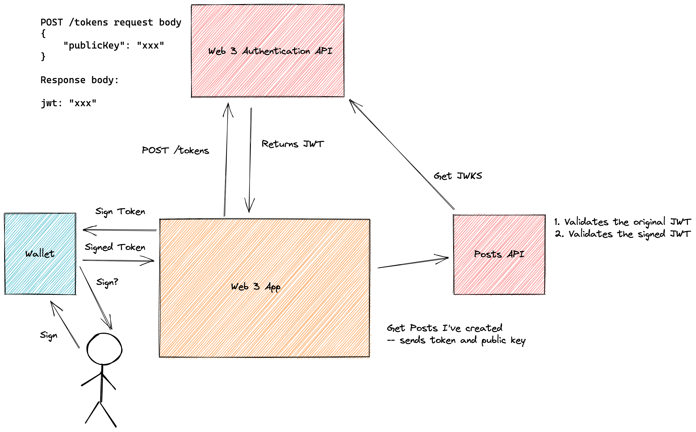

### Goal ###
In web3, we have two type of web3 applications (at the time of this writing).

Pure Web3 Apps - These applications only interact with smart contracts. They are pure because the only backend they have is a blockchain. In sense, the applications are truly decentralized and are the ideal for web3. However, not all applications can be purly web3 without incuring high levels of cost to the user. For example, if we built a pure web 3 messaging board in solana, every message would incure a cost to the user to store that message on the solana network. While one could develop a messaing board around this that makes storage cost an interesting feature of the platform it is still limiting.

Semi Web3 Apps - You must have a wallet to use it, but there is also a centralized backend for various aspects of the application. A prime example of this is games being built that utilize web3 but still have a central authority/server.

What often annoys me in the case of semi web 3 apps, is I still have to create an account with my email address and come up with some stupid passowrd. HUH? Really? Kill me now.

A different solution is to do authentication in a unqiue web 3 way. Have an OAuthy like server that generates a JWT for the user. That JWT will expire in x amount of time and is signed by a private key that only the authentication server knows.

Now the user must sign that JWT. Using that signed JWT, they can call whatever APIs they so desire and pass in their public key as a header. Those APIs will validate the JWT was signed with that public key, then decode the JWT and validate the publicKey in the decoded JWT matches that JWT. Finally they will validate the JWT was signed by the authentication server. BOOM, we know have Authorization AND NOT STUPID EMAIL PASSWORD.

See image below
